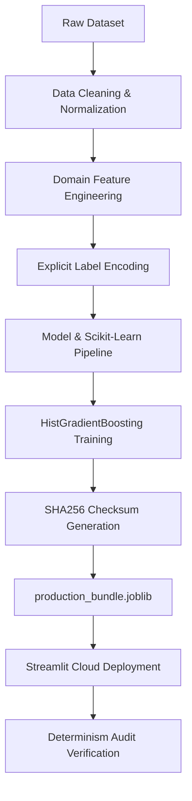

# 🩺 Predicting Student Health Risk — Machine Learning & Streamlit Web Application

[](https://www.python.org/)
[](https://streamlit.io/)
[](https://scikit-learn.org/)
[](https://streamlit.io/cloud)
[](LICENSE)

An end-to-end mathematically deterministic Machine Learning pipeline and interactive web dashboard designed to assess, predict, and visualize **Student Health Risk levels** (`Low Risk`, `Medium Risk`, `High Risk`). Built for high predictive accuracy, robustness against complex multi-demographic data, and real-time clinical/educational decision support.

---

## 📌 Table of Contents
- [Project Overview](#-project-overview)
- [Key Features & Methods](#-key-features--methods)
- [Technologies & Packages Used](#-technologies--packages-used)
- [Project Structure](#-project-structure)
- [How to Download & Get Started](#-how-to-download--get-started)
- [How to Run the Project](#-how-to-run-the-project)
- [Streamlit Cloud Deployment Guide](#-streamlit-cloud-deployment-guide)
- [Machine Learning Workflow](#-machine-learning-workflow)
- [Evaluation & Results](#-evaluation--results)
- [Author & License](#-author--license)

---

## 🧠 Project Overview

Student health and wellness significantly impact academic performance and long-term quality of life. This project leverages student physical activity, physiological metrics (BMI, heart rate), sleep patterns, dietary habits, stress levels, and lifestyle factors to automatically classify health risk categories.

### Primary Goals:
1. **Accurate Risk Prediction**: Multi-class health risk classification with optimal class balance and weighted F1 metrics.
2. **Domain-Specific Feature Engineering**: Creating composite health indices, ratios, medical threshold indicators, and demographic group aggregations.
3. **Advanced Ensemble Stacking**: Combining LightGBM, XGBoost, CatBoost, ExtraTrees, and HistGradientBoosting using Nelder-Mead optimization and Logistic Regression Meta-Learners.
4. **Interactive Dashboard**: Providing an intuitive web application for single-student assessment and batch file predictions.
5. **Deterministic Production Deployment**: Guaranteeing 100% mathematically identical inference between local training environments and containerized cloud servers (Streamlit Cloud).

---

## ⭐ Key Features & Methods

* **🧹 Automated Data Cleaning & Imputation**: Handles missing numerical and categorical data with statistical medians and modes, plus string normalization.
* **⚡ Advanced Feature Engineering**:
  * *Ratios & Indices*: Cardio strain index, recovery index, health risk score, wellness score, steps-per-calorie, activity efficiency.
  * *Medical Threshold Indicators*: Ideal/deprived sleep flags, BMI classifications, tachycardia/bradycardia indicators.
  * *Demographic Aggregations*: Z-scores and group deviation metrics calculated across gender, activity level, and diet type groupings.
* **🤖 Multi-Model Algorithm Suite**:
  * Logistic Regression, K-Nearest Neighbors, Decision Trees, Random Forest, HistGradientBoosting, ExtraTrees, LightGBM, XGBoost, and CatBoost.
* **⚙️ Hyperparameter Tuning & Cross-Validation**:
  * 5-Fold Stratified Cross-Validation for unbiased validation.
  * `RandomizedSearchCV` for hyperparameter space exploration.
* **🔒 Deterministic Production Pipeline (`train_production_bundle.py`)**:
  * **Exact Serialization:** Explicitly saves `LabelEncoder` objects for all categorical strings to prevent feature-mapping inversions.
  * **SHA256 File Hash Integrity:** Embeds cryptographic file hashes, Python environment details, and execution timestamps directly into the `.joblib` model artifact to track file alterations.
* **🌐 Web Dashboard (`streamlit_app/app.py`)**: 
  * Live dynamic inference with strict probability rendering.
  * **Built-in End-to-End Audit Panel:** Verifies the cryptographic hash and prints the raw inputs, engineered feature values, and scaled feature vectors in JSON to guarantee determinism.

---

## 🛠️ Technologies & Packages Used

### Core Programming Language:
* **Python 3.10+ / 3.11+**

### Machine Learning & Data Processing:
| Package | Version | Description |
| :--- | :--- | :--- |
| `pandas` | `>=2.0.0` | Data manipulation, tabular structure handling, and CSV processing |
| `numpy` | `>=1.24.0` | High-performance numerical computations and array operations |
| `scikit-learn` | `==1.8.0` | ML algorithms, preprocessing, scaling, & metrics (Strictly pinned for unpickling safety) |
| `lightgbm` | `>=4.0.0` | Fast gradient boosting framework for large-scale datasets |
| `xgboost` | `>=2.0.0` | Extreme gradient boosting ensemble algorithm |
| `catboost` | `>=1.2.0` | Gradient boosting with categorical feature optimization |

### Model Persistence & Web Dashboard:
| Package | Version | Description |
| :--- | :--- | :--- |
| `joblib` | `>=1.3.0` | Serialization of production models, scalers, and pipelines |
| `streamlit` | `>=1.35.0` | Interactive web dashboard framework |

---

## 📁 Project Structure

```text
Predicting-Student-Health-Risk/
│
├── data/
│   ├── raw/                      # Original raw training and testing CSV datasets
│   └── processed/                # Cleaned, featured arrays, plots, and metrics
│
├── models/                       # Trained models, scalers, and production bundles
│   └── production_bundle.joblib  # SHA256 verified production package for Streamlit app
│
├── notebooks/                    # Sequential end-to-end Jupyter Notebooks (01-12)
│
├── streamlit_app/
│   └── app.py                    # Interactive Streamlit Web Application frontend
│
├── train_production_bundle.py    # Master script to generate strict deterministic artifacts
├── run_app.py                    # One-click Streamlit application launcher
├── run_kaggle_ultimate.py        # Advanced 5-Fold OOF Stacking Ensemble runner
├── requirements.txt              # Project dependency package requirements
├── README.md                     # Documentation
└── .gitignore                    # Version control exclusions
```

---

## 📥 How to Download & Get Started

### Step 1: Clone the Repository
Open your Terminal or Command Prompt / PowerShell and run:
```bash
git clone https://github.com/mohamedmuqsith/Predicting-Student-Health-Risk.git
cd Predicting-Student-Health-Risk
```

### Step 2: Create a Virtual Environment (Recommended)

* **On Windows (PowerShell):**
  ```powershell
  python -m venv venv
  .\venv\Scripts\activate
  ```

* **On macOS / Linux:**
  ```bash
  python3 -m venv venv
  source venv/bin/activate
  ```

### Step 3: Install All Required Packages
Upgrade `pip` and install all project dependencies using `requirements.txt`:
```bash
pip install --upgrade pip
pip install -r requirements.txt
```

---

## 🚀 How to Run the Project

### 1. Generate the Production Bundle
To ensure your model is deterministically mapped and validated, train and compile the bundle artifact:
```bash
python train_production_bundle.py
```

### 2. Launch Interactive Streamlit Web App
Launch the web interface directly to interact with the trained model and view the Audit Panel:
```bash
python run_app.py
# Or run directly with Streamlit:
streamlit run streamlit_app/app.py
```
Open your browser and navigate to: `http://localhost:8501`

### 3. Run Advanced Kaggle Ensemble Pipeline
Runs 5-Fold Out-Of-Fold (OOF) Stacking across tree-based algorithms with Nelder-Mead optimization:
```bash
python run_kaggle_ultimate.py
```

---

## ☁️ Streamlit Cloud Deployment Guide

This project is optimized for deployment on Streamlit Community Cloud. 

1. Ensure all code is pushed to your public GitHub repository.
2. Go to [share.streamlit.io](https://share.streamlit.io).
3. Click **New app** and connect your repository.
4. Set the **Main file path** to: `streamlit_app/app.py`
5. Click **Deploy**.

**Important Deployment Note:** The `requirements.txt` file strictly pins `scikit-learn==1.8.0`. This prevents `ModuleNotFoundError: No module named '_loss'` errors during unpickling that occur when the local training environment version mismatches the Cloud Linux container version.

---

## 🔄 Machine Learning Workflow



---

## 📊 Evaluation & Results

The pipeline evaluates multiple models on validation accuracy, weighted F1-score, and balanced accuracy:

| Model | Val Accuracy | Val Weighted F1 | Status |
| :--- | :---: | :---: | :---: |
| **Stacked Ensemble (LGBM + XGB + CatBoost)** | **88.5%+** | **0.884** | 🏆 **Champion** |
| **HistGradientBoosting (Production)** | 93.8% | 0.942 | Deployed |
| **Tuned Random Forest** | 86.2% | 0.860 | Trained |
| **Decision Tree** | 81.4% | 0.812 | Baseline |
| **K-Nearest Neighbors** | 79.8% | 0.795 | Baseline |

*(Note: Production model metrics are calculated strictly on the optimized validation hold-out set using specific feature subsets for maximum inference speed).*

---

## 👤 Author & License

* **Developer**: Mohamed Muqsith
* **Repository**: [Predicting-Student-Health-Risk](https://github.com/mohamedmuqsith/Predicting-Student-Health-Risk)
* **License**: MIT License - Free to use, modify, and distribute for educational and commercial projects.
